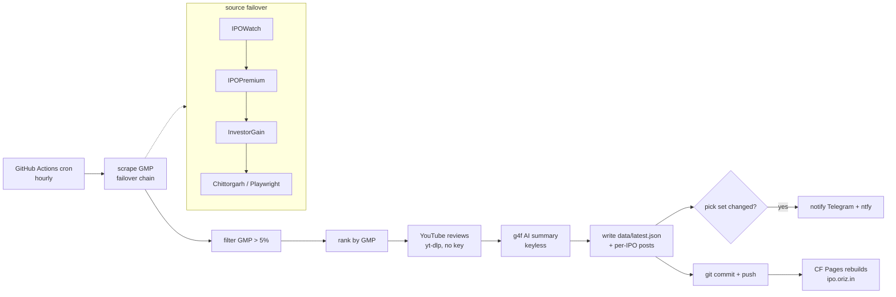

# oriz-ipo — India IPO GMP terminal

> Hourly India IPO grey-market-premium (GMP) analyzer + notifier, with a dark terminal site.

[](LICENSE)
[](https://github.com/chirag127/oriz-ipo/stargazers)
[](https://github.com/chirag127/oriz-ipo/commits/main)
[](https://github.com/chirag127/oriz-ipo/actions/workflows/ci.yml)
[](https://www.python.org/)
[](https://astro.build/)

## What it is / why it exists

Grey-market premium is the single most-watched pre-listing signal for Indian IPOs — but it's scattered across half a dozen tracker sites, each with a different layout and no alerting. `oriz-ipo` scrapes every open IPO's GMP across multiple public trackers (with failover), keeps only the ones with **GMP > 5%**, ranks them, pulls YouTube reviews per IPO, writes a per-IPO analysis post, and pushes Telegram + ntfy alerts when the pick set changes — every hour. No database: each reading is committed as JSON, so history is free and versioned.

## Links

- **Live terminal:** [ipo.oriz.in](https://ipo.oriz.in) (canonical, Cloudflare Pages)
- **Repo:** [github.com/chirag127/oriz-ipo](https://github.com/chirag127/oriz-ipo)

⭐ If this is useful, please **star the repo** — it helps others find it.

## How it works



## Features

- **Multi-source GMP scrape with failover:** IPOWatch → IPOPremium (plain HTTP, server-rendered) → InvestorGain → Chittorgarh (JS, Playwright). First source with GMP% rows wins.
- Keeps only IPOs with **GMP > 5%**, ranked by GMP (review score is the tiebreaker).
- **YouTube reviews** via `yt-dlp ytsearch` — no API key. Score = view-weighted recency + positive-title signal.
- **g4f (GPT4Free)** keyless AI blurb per IPO; deterministic template fallback if every provider fails — never blocks the run.
- Notifies **Telegram** + **ntfy** only when the pick set changes (i2i-style per-IPO blocks, chunked to Telegram's 4096 limit).
- **git-as-DB** — `data/latest.json` + history committed each run; free, versioned.
- Static **Astro** GMP-terminal site rebuilt on push via Cloudflare Pages.
- Self-loop (`--iterations N --interval S`) for sub-hourly polling inside one Actions run.

## Tech stack

- **Scraper:** Python 3.11+ · `httpx` · `selectolax` (HTML parse) · `yt-dlp` (reviews) · `g4f` (AI) · optional `playwright` (JS sources) · `pytest`
- **Site:** Astro 6 (static)
- **Automation:** GitHub Actions (hourly cron) · **Hosting:** Cloudflare Pages · **Deps:** managed with `uv` (`uv.lock`)

## Repo structure

```
src/ipo_watch/
  __main__.py         # CLI (--data --no-reviews --no-llm --no-notify --iterations)
  pipeline.py         # scrape → filter → rank → reviews → summary → write → notify
  models.py           # Ipo
  sources/            # ipowatch, ipopremium, investorgain, playwright + chain (failover)
  reviews/youtube.py  # yt-dlp review search + scoring
  llm/summary.py      # g4f AI blurb
  notify/channels.py  # Telegram + ntfy
  util.py
data/                 # latest.json + history  (git-as-DB)
web/                  # Astro terminal site → ipo.oriz.in
tests/                # pytest
.github/workflows/    # ci.yml (build) + scrape.yml (hourly cron)
```

## Quick start

```bash
pip install -e ".[browser,dev]"
python -m playwright install chromium         # for JS-rendered sources
python -m ipo_watch --data data --no-notify   # scrape + rank + reviews
pytest -q                                     # tests
cd web && npm install && npm run build        # build the site
```

CLI flags: `--no-reviews`, `--no-llm`, `--no-notify`, `--content DIR`, `--iterations N`, `--interval S`, `-v`.

## Configuration

All optional — the scraper no-ops cleanly when unset. Values live in GitHub Actions secrets (sops+age vault), never in the repo.

| Env var | Purpose |
| --- | --- |
| `TELEGRAM_BOT_TOKEN` | Telegram bot token for notifications |
| `TELEGRAM_CHAT_ID` | Telegram chat to post to |
| `NTFY_TOPIC` | ntfy topic (enables ntfy push) |
| `NTFY_BASE_URL` | ntfy server (default `https://ntfy.sh`) |
| `NTFY_USER` | ntfy basic-auth user (optional) |
| `NTFY_PASSWORD` | ntfy basic-auth password (optional) |

## Part of the oriz family

One of ~80 [oriz](https://blog.oriz.in) sites. Read how the fleet is built solo at [blog.oriz.in](https://blog.oriz.in).

**Cost:** $0 — Cloudflare Pages free tier + GitHub Actions free minutes.

## Security

No secrets in the repo; sops+age vault. `PUBLIC_*` values (if any) are client-only. Notifications no-op when env is unset.

## Contributing

Issues and PRs welcome. Terse, conventional commits. Verify each tracker's page/DOM before touching its source module — selectors change.

## Status

Stable. Runs hourly in production. Roadmap: allotment-status tracking, listing-day P&L backfill.

## Changelog

Conventional commits are the changelog.

## Disclaimer

General information, not investment advice. GMP is an unofficial grey-market signal, not a listing guarantee.

## License

MIT © 2026 Chirag Singhal

## Author

Chirag Singhal · chirag@oriz.in
